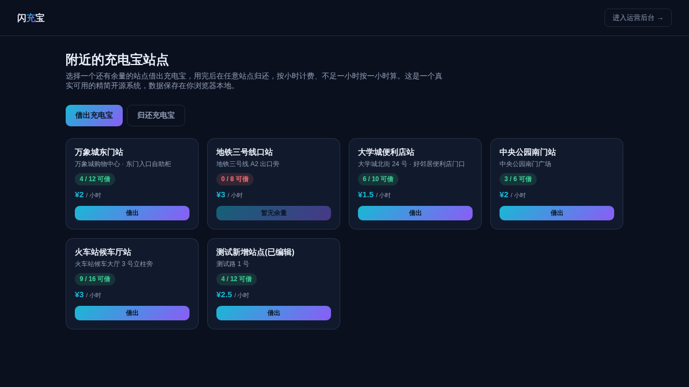

# 共享充电宝租借管理系统（精简开源版）· PowerBank Lite

**[在线体验（用户端）→](https://anna123123123-creator.github.io/powerbank-lite/)** · **[运营后台 →](https://anna123123123-creator.github.io/powerbank-lite/admin.html)**

免费开源的共享充电宝租借管理系统精简版。这不是截图或原型图，是一个**真实可用**的前后台系统：站点浏览、扫码借出、异地归还、按小时计费、余量校验，后台站点增删改查、订单管理、收入看板——都是真功能，纯前端 + `localStorage` 实现，不需要服务器、不需要数据库，克隆下来打开就能用，也适合作为学习或二次开发的起点。



## 功能

**用户端**
- 站点列表浏览，实时显示各站点可借数量 / 总插槽数、每小时价格
- 借出充电宝：选择还有余量的站点，填写手机号，一键借出；余量为 0 的站点按钮自动禁用，强行触发也会被拒绝并提示
- 归还充电宝：按手机号查询自己进行中的订单，选择任意站点归还
- 归还时自动结算：按实际使用时长计费，**不足一小时按一小时计**，费用 = 计费小时数 × 归还站点单价，结算结果即时展示

**运营后台**
- 仪表盘：站点总数、总插槽数、进行中订单数、本月已完成订单收入（按订单归还月份实时汇总），以及最近订单列表
- 站点管理：新增、编辑、删除站点；编辑时校验「可借数不能超过总插槽数」「总插槽数不能低于当前可借数」，非法修改会被拒绝并给出明确错误提示
- 订单管理：查看全部借出与归还订单，按「进行中 / 已完成」筛选，展示借还站点、时间与费用

## 试用方法

克隆下来，直接用浏览器打开 `index.html`，或用静态文件服务器跑起来：

```bash
python3 -m http.server 8000
```

用户端在 `index.html`，运营后台在 `admin.html`。所有数据存在浏览器的 `localStorage` 里（`powerbank_lite_data_v1` 这个 key），后台侧边栏有"重置示例数据"按钮可以随时清空重来。

## 技术说明

没有用任何框架或构建工具，纯原生 HTML/CSS/JavaScript，一共 4 个文件：`data.js`（数据层，负责 localStorage 读写和种子数据）、`index.html` + `script.js`（用户端）、`admin.html` + `admin.js`（运营后台）。

因为是纯前端 Demo，数据只存在当前浏览器里，不同设备/浏览器之间不会同步——真实生产系统需要一个后端 API 和数据库来替换 `data.js` 里的存储层。对共享充电宝这类业务来说，还需要额外接入**真实硬件与物联网层**：设备需要通过蓝牙/物联网模块与后台联动完成实际的弹出与锁止、上报实时电量与在线状态、处理设备故障与掉线告警——这些都不是纯前端能覆盖的部分，界面和业务流程逻辑基本可以直接复用。

## 协议

MIT，随便怎么用都行。

## 需要定制版？

这个工具免费开源、可以直接用。如果你需要的是**改造成适合自己业务的版本**——换品牌、改字段、加功能、接后端或数据库——我可以做。

- **交付周期**：3–10 个工作日
- **交付内容**：完整源码（不加密、可自行二次开发）+ 在线地址 + 部署说明
- **已有 49 套现成系统**可直接改造，覆盖电商、教育、门店、内容、跨境等行业：[全部清单与在线演示](https://inzyxuashop.com)

把你的需求发给我，24 小时内回复可行性与报价：**evcdecd@gmail.com**
